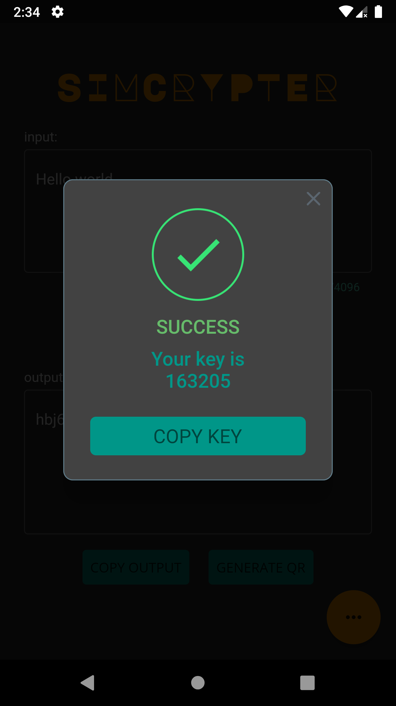
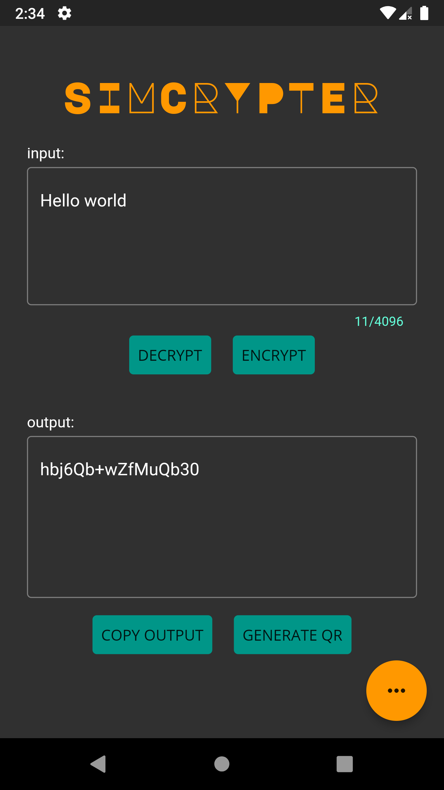
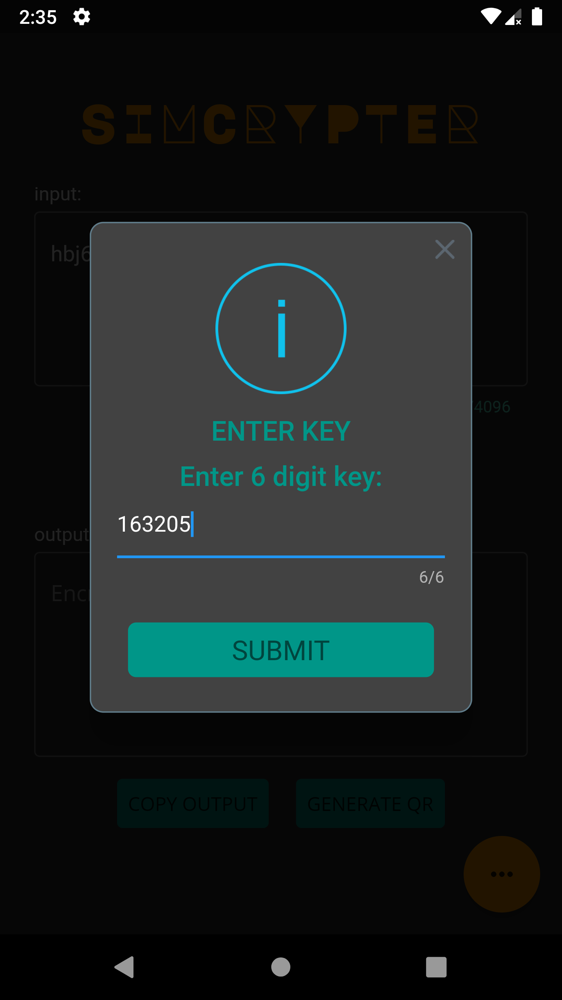
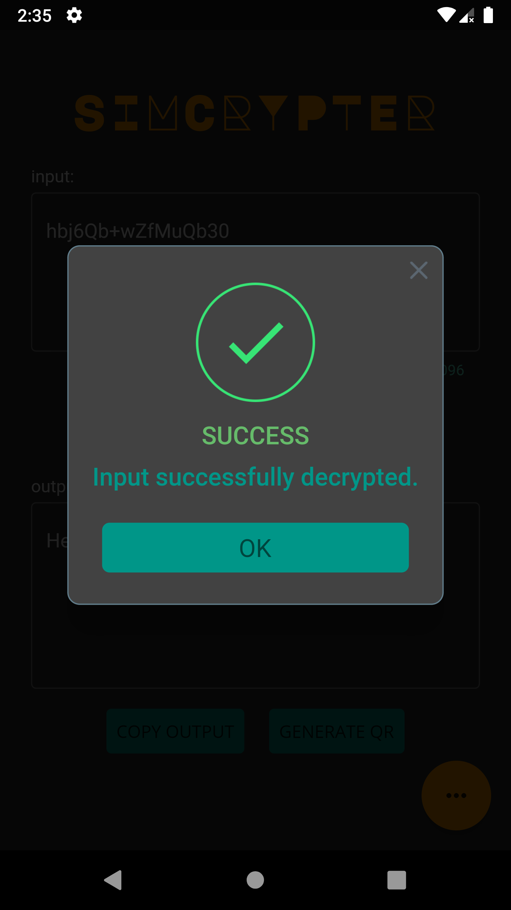
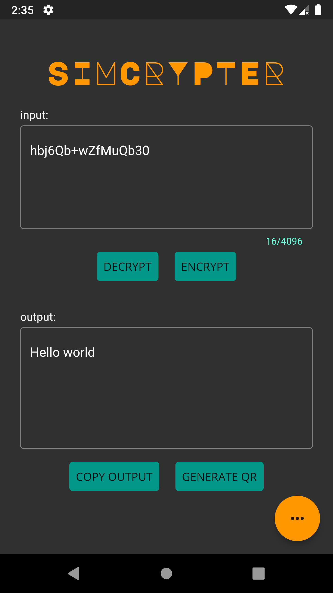
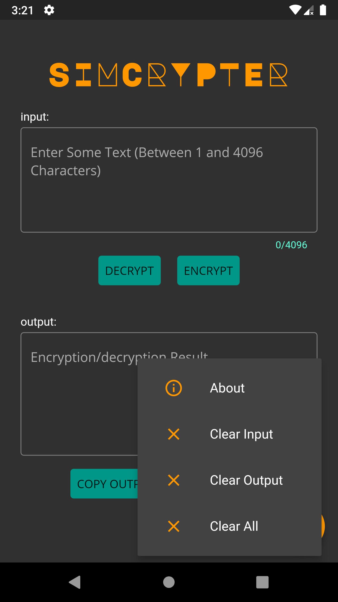
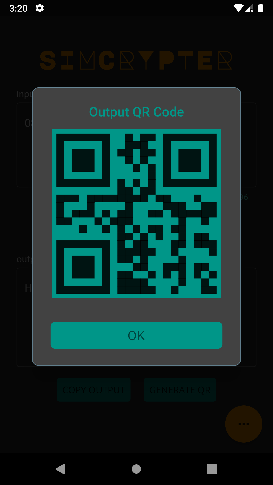

# simcrypter

A simple flutter application to encrypt and decrypt plaintext messages. Encryption and decryption is done via a substitution cipher.
The app has a couple of other features such as showing a QR code of the encryption/decryption output and quick access commands to clear input/output (or undo them).

## Screenshots

#### Encryption
  

#### Decryption
  

#### Actions menu and output QR code
 

## Disclaimer
This app is meant for fun and personal use and has not been vetted by cryptography security professionals. Please do not use this app as a substitute for cryptographically secure tools.
I accept no liability or responsibility to any person as a consequence of any reliance upon the services of this app.
